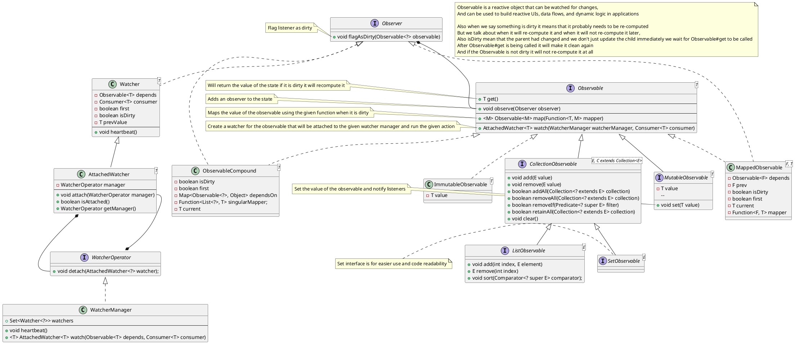

# 📺 Observable api

Available Since 0.0.39

**Table of content:**
- [Introduction](#introduction)
- [Usage](#usage)
- [How it works](#how-it-works)
- [Advantages](#advantages)
- [What next](#what-next)

## Introduction
The `Observable<T>` interface represents a reactive, stateful object that can be watched for changes. It provides a consistent and flexible API for building reactive UIs, data flows, and dynamic logic in applications.

Observables are designed to be either immutable or mutable, with support for compound states that automatically derive values from other observables. It includes built-in support for list-based observables, mapped observables, and reactive recomposition through dependency tracking.

This system is designed to be lightweight, composable, and extensible.

## Usage
<code-block lang="java" src="common/CodeSnippets.java" include-symbol="example"/>
<code-block lang="java" src="common/CodeSnippets.java" include-symbol="listExample"/>

## How it works

## Advantages
✅ Type-safe reactive model with strong generics and records.

♻️ Immutable and Mutable models support both predictable state and dynamic changes.

🔗 Composable—easy to derive, map, and observe values.

🧩 Extensible—can be combined into complex reactive graphs with minimal boilerplate.

🚀 Designed for performance and clarity with lazy re-computation and controlled observers.

## What next
*   Static observable value 
*   Dynamic observable value 
*   Compound two or more observables 
*   Map one Observable value to another value 
* :  List, Set, Map 
    *   List that could be observer 
    *   Set that could be observer 
*  <a href="https://refactoring.guru/design-patterns/observer"> Observer pattern </a>
*   Observer any changes and run the function on heartbeat 
* [Javadocs](https://cocoa-beans.apartium.net/%version%/common/net/apartium/cocoabeans/state/package-summary.html)