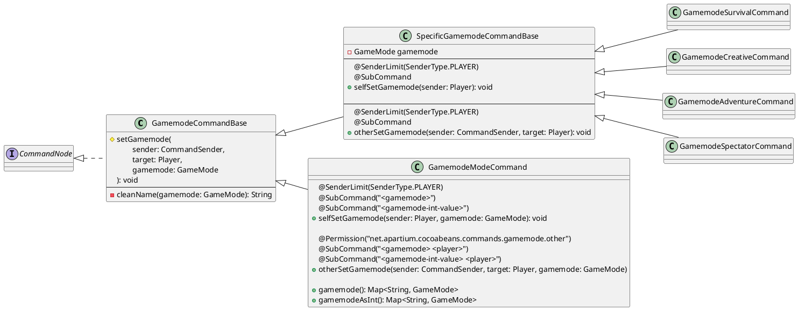

# 🧬 Polymorphic command declaration

<br id="introduction"/>
[🧬 Polymorphic](https://en.wikipedia.org/wiki/Polymorphism_(computer_science)) command declaration are way to make the process of writing commands easier and avoid code duplication in certain cases.

Polymorphic command declaration allows combining interfaces and classes, which can include sub commands, exception handles, source parsers and more. 

### An Example of creating command with Polymorphic

A good way to showcase the capabilities of this feature is by demonstrating how a /gamemode command can be made. 
Game mode is an enum value, the player can sets their own gamemode or set it for another player, if they have the permission for it.
Because gamemode is an enum, we will also make short hand commands to use for each.

This is the abstract class that is shared between all game mode commands. 
```java
@Permission("example.commands.gamemode.self")
/* package-private */ class GamemodeCommandBase implements CommandNode {
    
    protected setGamemode(CommandSender sender, Player target, GameMode gamemode) {
        target.setGamemode(gamemode);
        
        if (sender != target) {
            sender.sendMessage(target.getName() + " Gamemode have been set to " + cleanName(gamemode));
        }
        
        target.sendMessage("Your Gamemode have been set to " + cleanName(gamemode));
        
    }

    private String cleanName(GameMode gamemode) {
        return gamemode.name().subString(0, 1).toUpperCase() + gamemode.name().subString(1).toLowerCase();
    }
    
}
```

The below example is the superclass for all shorthand commands (eg /gmc, /gms)
```java
/* package-private */ class SpecificGamemodeCommandBase extends GamemodeCommandBase {
    
    private final GameMode gamemode;
    
    public SpecificGamemodeCommandBase(GameMode gamemode) {
        this.gamemode = gamemode;
    }
    
    @SenderLimit(SenderType.PLAYER)
    @SubCommand
    public void selfSetGamemode(Player sender) {
        setGamemode(sender, sender, gamemode);
    }

    @Permission("net.apartium.cocoabeans.commands.gamemode.other")
    @SubCommand("<player>")
    public void otherSetGamemode(CommandSender sender, Player target) {
        setGamemode(sender, target, gamemode);
    }
    
}
```
Here is an example of creating short hand commands, note how minimal the class is. 
<tabs>
<tab title="Survival">

```java
@Command(value = "gms", aliases = {"gm0"})
public class GamemodeSurvivalCommand extends SpecificGamemodeCommandBase {

    public GamemodeSurvivalCommand() {
        super(GameMode.SURVIVAL);
    }

}
```

</tab>
<tab title="Creative">

```java
@Command(value = "gmc", aliases = {"gm1"})
public class GamemodeCreativeCommand extends SpecificGamemodeCommandBase {

    public GamemodeCreativeCommand() {
        super(GameMode.CREATIVE);
    }

}

```

</tab>
<tab title="Adventure">

```java
@Command(value = "gma", aliases = {"gm2"})
public class GamemodeAdventureCommand extends SpecificGamemodeCommandBase {

    public GamemodeAdventureCommand() {
        super(GameMode.ADVENTURE);
    }

}
```

</tab>
<tab title="Spectator">

```java
@Command(value = "gmsp", aliases = {"gm3"})
public class GamemodeSpectatorCommand extends SpecificGamemodeCommandBase {

    public GamemodeSpectatorCommand() {
        super(GameMode.SPECTATOR);
    }

}
```

</tab>
</tabs>

We would also like to allow players to use the full form of the command, eg /gamemode creative.
```java
@Command(value = "gamemode", aliases = {"gm"})
public class GamemodeModeCommand extends GamemodeCommandBase {

    @SenderLimit(SenderType.PLAYER)
    @SubCommand("<gamemode>")
    @SubCommand("<gamemode-int-value>")
    public void selfSetGamemode(Player sender, GameMode gamemode) {
        setGamemode(sender, sender, gamemode);
    }

    @Permission("net.apartium.cocoabeans.commands.gamemode.other")
    @SubCommand("<gamemode> <player>")
    @SubCommand("<gamemode-int-value> <player>")
    public void otherSetGamemode(CommandSender sender, Player target, GameMode gamemode) {
        setGamemode(sender, target, gamemode);
    }

    @SourceParser(keyword = "gamemode", clazz = GameMode.class, resultMaxAgeInMills = -1)
    public Map<String, GameMode> gamemode() {
        return Arrays.stream(GameMode.values()).collect(Collectors.toMap(
                value -> value.name().toLowerCase(), value -> value
        ));
    }

    @SourceParser(keyword = "gamemode-int-value", clazz = GameMode.class, resultMaxAgeInMills = -1)
    public Map<String, GameMode> gamemodeAsInt() {
        return Arrays.stream(GameMode.values()).collect(Collectors.toMap(
                value -> value.value() + "", value -> value
        ));
    }
    
}
```

Here we have a diagram of everything we have done 


## More examples
<tabs>
<tab title="Minigame command">

```java
public class GameCommandBase implements CommandNode {
    
    @SubCommand("start")
    public abstract void start(Sender sender);
    
    @SubCommand("stop")
    public abstract void stop(Sender sender);
    
    @SubCommand("add <player>")
    public abstract void addPlayer(Sender sender, Player target);
    
    @SubCommand("kick <player>")
    public abstract void kickPlayer(Sender sender, Player target);
    
    @SubCommand("set stage <game-stage>")
    public abstract void setGameStage(Sender sender, GameStage stage);
    
}

public enum GameStage {
    WAITING,
    STARTING,
    ON_GOING,
    ENDING,
    CLOSED,
    FAILED,
    UNKNOWN
}
```

</tab>
</tabs>

## Conclusion 🎉
By using polymorphic command declaration, we can create a robust and clean command system that is easy to extend and maintain, providing a better developer experience and improving the overall quality of the codebase.